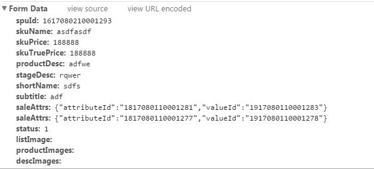
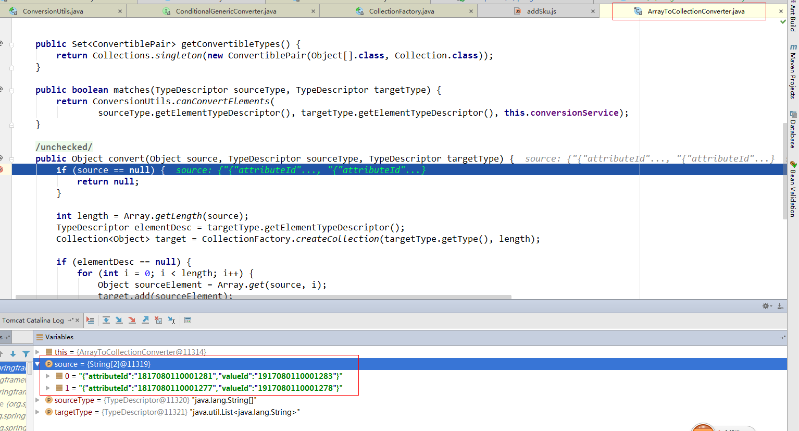

# 1、问题描述

在项目中，很多时候我们想在前端页面传递一个数组到后端，通过List或者Array的方式来接收。如果我们使用jquery来post提交，默认提交如果是数组的话，比如a:[v1, v2]，提交的数据格式为：a[]=v1&a[]=v2，但是我们spring接收的属性名为a，导致不匹配。

这个时候我们使用了 `$.param(object, traditional)` 方法，具体使用如下：

```java
var saleAttrArray = new Array();

$(element).each(function () {
    if (condition){
        // 数组增加元素
        saleAttrArray.push(JSON.stringify(value));
    }
});

var reqPara = {
    ...
    saleAttrs: saleAttrArray,
    ...
};

// 可以将 traditional 参数设置为 true，来模拟 jQuery 1.4 之前版本中 $.param() 的行为
var param = $.param(reqPara,true);

$.post("/erp/sku/save", param, function (res) {
    if (res.success) {
        location.href = "/erp/spu/show?spuId="+spuId;
    }else {
        showWarn(res.content);
    }
}, "json")
```

具体 `$.param(reqPara, true)` 为什么使用true请参考文档：[w3c](http://www.w3school.com.cn/jquery/ajax_param.asp)

现在数组a:[v1, v2]的提交已经变成了a=v1&a=v2的形式了。但是如果v1这个字符串是一个json串，并且中间有逗号，spring接收到就会有问题：

例如，`a={"attributeId":"1817080110001281","valueId":"1917080110001283"}`，spring在后台传递到List<String> a中去的时候不是一个元素，而是两个：`{"attributeId":"1817080110001281"`和`"valueId":"1917080110001283"}`，导致接收异常。

# 2、定位问题

这个问题感觉像是spring对字符串转list做了一些处理，太过于智能化了。通过源码分析我们最终定位到是DataBinder的时候调用了`StringToCollectionConverter`的convert方法来进行转换，其中代码如下：

```java
public Object convert(Object source, TypeDescriptor sourceType, TypeDescriptor targetType) {
    if (source == null) {
        return null;
    }
    String string = (String) source;

    // 这句话就是把字符串根据逗号拆分的祸源
    String[] fields = StringUtils.commaDelimitedListToStringArray(string);
    TypeDescriptor elementDesc = targetType.getElementTypeDescriptor();
    Collection<Object> target = CollectionFactory.createCollection(targetType.getType(), fields.length);

    if (elementDesc == null) {
        for (String field : fields) {
            target.add(field.trim());
        }
    }
    else {
        for (String field : fields) {
            Object targetElement = this.conversionService.convert(field.trim(), sourceType, elementDesc);
            target.add(targetElement);
        }
    }
    return target;
}

public static String[] commaDelimitedListToStringArray(String str) {
    return delimitedListToStringArray(str, ",");
}
```

但是数组里面要是有两个元素，就不会出现这个问题了，因为spring会去找另外一个Converter：`ArrayToCollectionConverter`，这里面就不会对字符串进行拆分处理。参数传递以及源码截图如下：





找到问题了，我们开始解决它。

# 3、解决问题

spring通过识别source和target的类型寻找对应的converter来进行转化，我们可不可以自定义一个converter呢？

答案当然是可以的，我们在spring的配置文件中增加一个bean，class为`org.springframework.format.support.FormattingConversionServiceFactoryBean`，我们看看它的核心代码：

```java
public void afterPropertiesSet() {
    this.conversionService = new DefaultFormattingConversionService(this.embeddedValueResolver, this.registerDefaultFormatters);
    ConversionServiceFactory.registerConverters(this.converters, this.conversionService);
    registerFormatters();
}

// 注册converter
public static void registerConverters(Set<?> converters, ConverterRegistry registry) {
    if (converters != null) {
        for (Object converter : converters) {
            if (converter instanceof GenericConverter) {
                registry.addConverter((GenericConverter) converter);
            }
            else if (converter instanceof Converter<?, ?>) {
                registry.addConverter((Converter<?, ?>) converter);
            }
            else if (converter instanceof ConverterFactory<?, ?>) {
                registry.addConverterFactory((ConverterFactory<?, ?>) converter);
            }
            else {
                throw new IllegalArgumentException("Each converter object must implement one of the " +
                        "Converter, ConverterFactory, or GenericConverter interfaces");
            }
        }
    }
}
```

可以看到上面注册的converter可以是三种类型：`GenericConverter、Converter、ConverterFactory`，`Converter`是最简单的一种类型，用来实现简单的类型转换，比如String转List，但是我们这里最好定义一个复杂类型，String转Collection的，这时候我们就用到了`GenericConverter`这个接口了。

我们这里的需求是把String转换成Collection<Object>或者Collection<String>，所以动手开始写一个Converter吧。

这个类是用来提供自定义converter的。我们可以进行如下的配置：

```java
<bean id="customConversionService" class="org.springframework.format.support.FormattingConversionServiceFactoryBean">
    <property name="converters">
        <set>
            <bean class="com.jd.jr.cf.erp.web.support.StringToCollectionConverter"/>
        </set>
    </property>
</bean>
```

对应的StringToCollectionConverter源码为：

```java
package com.jd.jr.cf.erp.web.support;

import org.springframework.core.CollectionFactory;
import org.springframework.core.convert.ConversionService;
import org.springframework.core.convert.TypeDescriptor;
import org.springframework.core.convert.converter.ConditionalGenericConverter;
import org.springframework.core.convert.converter.GenericConverter;
import org.springframework.core.convert.support.DefaultConversionService;

import java.util.Collection;
import java.util.Collections;
import java.util.Set;

/**
 * User: 吴海旭
 * Date: 2017-08-02
 * Time: 上午10:54
 */
public class StringToCollectionConverter implements ConditionalGenericConverter {

	private final ConversionService conversionService;

	public StringToCollectionConverter() {
		this.conversionService = new DefaultConversionService();
	}

	@Override
	public boolean matches(TypeDescriptor sourceType, TypeDescriptor targetType) {
		return sourceType.getType() == String.class &&
				(targetType.getElementTypeDescriptor() == null ||
					targetType.getElementTypeDescriptor().getType() == String.class);
	}

	@Override
	public Set<ConvertiblePair> getConvertibleTypes() {
		return Collections.singleton(new ConvertiblePair(String.class, Collection.class));
	}

	@Override
	public Object convert(Object source, TypeDescriptor sourceType, TypeDescriptor targetType) {
		if (source == null) {
			return null;
		}
		String string = (String) source;
		Collection<Object> target = CollectionFactory.createCollection(targetType.getType(), 1);
		target.add(string);
		return target;
	}
}
```

最后我想感叹一句，spring太智能了有时候也是个坑！